# Lore

  - Work in progress.

In the beginning, the world was divided by a fragile veil in a physical
plane, in which the primordial humans lived, and a plane made of mana,
in which formless beings existed.

As holes began to appear in the veil, eventually causing it to disappear
completely, the beings from the mana plane were forced to take physical
form. The ones who managed to do so on their own became known as
fairies, which later originated the beastfolk, the elves and the gods.
The ones who had to possess a host — sometimes humans, but mostly other
animals — to do so became known as demons, which originated the demon
beasts and the demonfolk.

For the first couple thousand years after the planes became one, strife
amongst the races was common, which ended with the vicious demonfolk
being banished into the northern lands, the gods going into reclusion or
forming their own countries, the elves establishing themselves in
forests and the humans and the beastfolk commingling.

